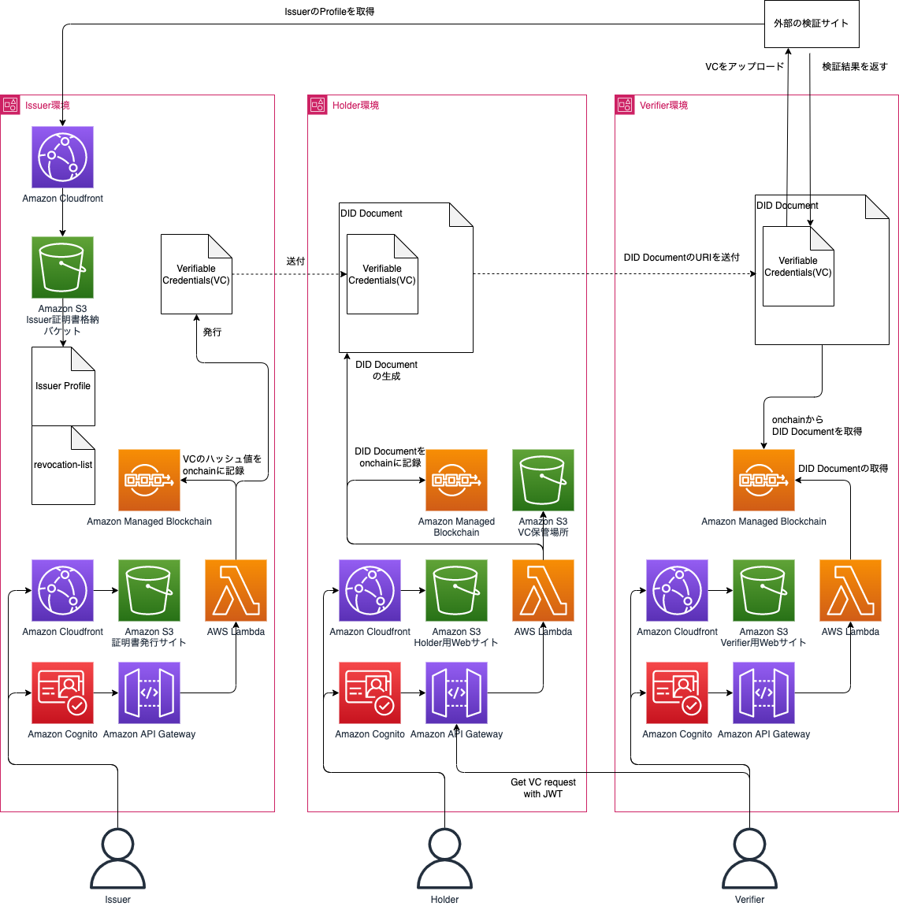
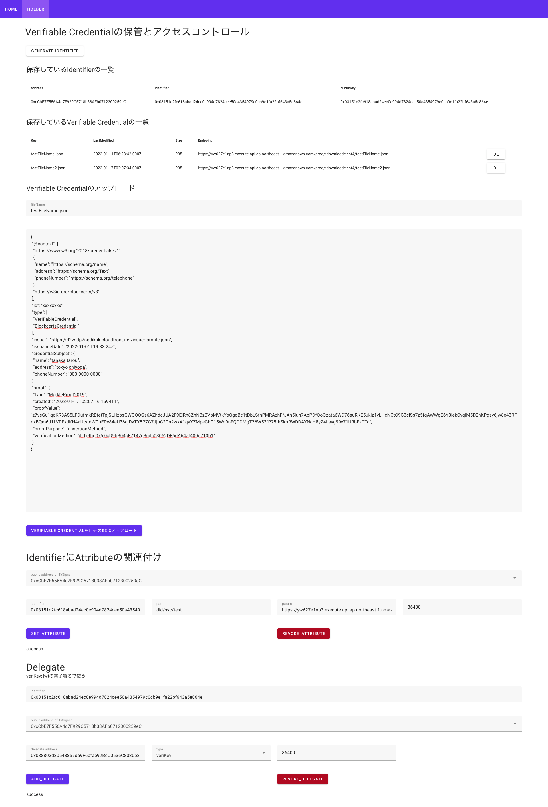
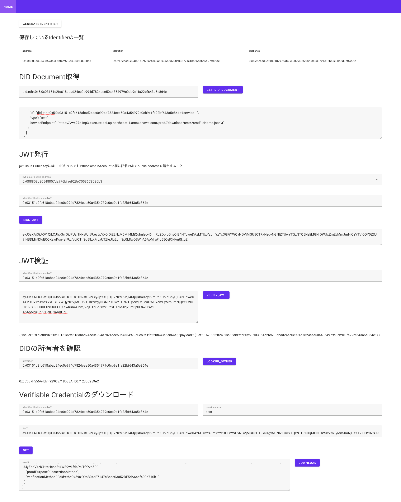

## プロジェクト概要/Project Detailes

W3Cの標準化規格であるDIDs v1.0で実装したdecentralized identityのサンプルコードです。  
DID Documentでアクセス権限の設定をした相手にだけにVerifiable Credentialのアクセスを許可する仕組みをAWSで実装しました。  
このサンプルコードはEthereumのテストネットで稼働します。  
This is sample code implemented in DIDs(decentralized identity) v1.0, which is a standardized standard for W3C. 
We have implemented a mechanism in AWS that allows access to Verifiable Credentials only to those for whom access authority has been set in DID Document.
This sample code will be running on Ethereum testnet.

このプロジェクトは以下のことができます。  
This project able to these functions.

- IssuerがVerifiableCredentialの発行  
Issuer create a VerifiableCredential
- Holderが自分のVerifiableCredentialを保管。  
Holder can store own VerifiableCredential
- HolderがVerifiableCredentialからDID Documentを作成  
Holder creates DID Document from verifiableCredential
- VerifierがJWTを使用してHolderのVerifiableCredentialにアクセス  
Verifier uses JWT to access Holder's VerifiableCredential
- VerifierがVerifiableCredentialの正しさを検証  
Verifier verifies the correctness of VerifiableCredential

## DIDの概要図/Overview 

## アーキテクチャ/Architecture

## イメージ/Screenshot

- Issuerの操作画面/Issuer operation window

- Holderの操作画面/Holder operation window

- Verifierの操作画面/Verifier operation window

# ドキュメント/Documents
- [環境構築手順/How to deploy](./docs/DeployEnvironment)
- [API仕様書/API document](./docs/spec/)
- [使い方/How to Use](./docs/HowToUse/)

## Depends On
- Blockcerts: https://github.com/blockchain-certificates/cert-verifier-js
- ethr-did: https://github.com/uport-project/ethr-did
- ethr-did-resolver: https://github.com/decentralized-identity/ethr-did-resolver

## Security

See [CONTRIBUTING](CONTRIBUTING.md#security-issue-notifications) for more information.

## License

This library is licensed under the MIT-0 License. See the LICENSE file.
