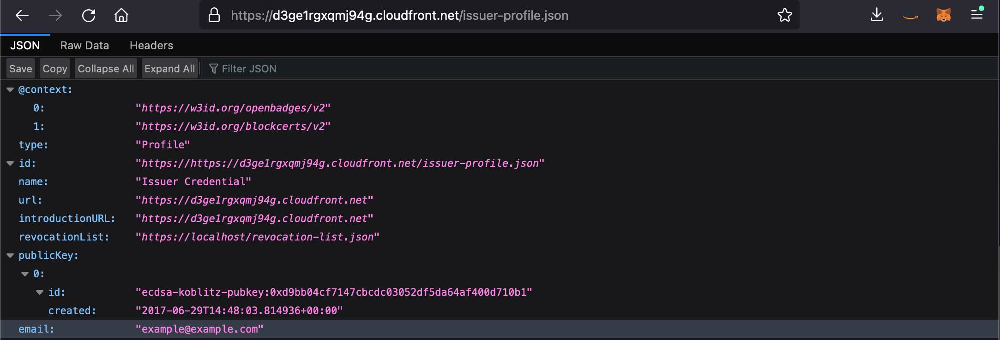

Issuer Profileの作成/Create Issuer Profile
===

## Issuer Profileとは/What is Issuer Profile
Issuerが発行した証明書の署名を検証するために必要な情報を記録し、外部と共有するためのファイルである。Verifiable Credentialを受領したHolderやVerifierが検証時に使用する。  
It is a file for recording information neccesary to verify the signature of a certificate issued by issuer and sharing it with the outside world. 
Holders and Verifiers that have received the Verifiable Credentil are used druing verification.

## Issuerの秘密鍵と公開鍵を作成/Create Issuer's keypair

- `utils` のディレクトリに含まれる`createWallet.js`を実行する. 出力結果をメモしておく。  
Run `createWallet.js` in `utils` folder . Please note of the output result

> 秘密鍵は厳重に保管し、他人と共有しないよう注意すること.   
Do not share this keypair. Please save carefully.


```
$ cd utils
$ npm install
$ node createWallet.js 
{
address: '0x...',
privateKey: '0x...',
publicKey: '0x...'
}
```

- addressはブロックチェーンのウォレットアドレスとなる。証明書を発行するためにはブロックチェーンに書き込む必要があるため、ガス代と呼ばれる手数料が必要となる。このウォレットに対してガス代を支払うための暗号資産を少量入金する。  
address become wallet of blockchain. We need Gas for pay transaction fee when ssue Verifiable Credential.Send few crypto currency to this address for pay gas fee.

  - Goerliのテストネットであればこちらでテスト用の暗号資産を取得することができる。  
  You can get gas fee of Goerli testnet at this faucet website.  
    https://goerlifaucet.com/

## CDKで使用するLambdaの依存パッケージを事前にインストールする/ Install dependency packages for CDK and Lambda
```
$ cd cdk/lambda/nodejs
$ npm install
```

## Issuer Profile配布用のS3とCloudFrontを作成/ Create S3 and CloudFront for publish the Issuer Profile.

- アクセス可能なIPアドレスを制限するために、環境変数を設定する.  
Assuming it's a demo environment, set environment variables to limit the IP addresses that can be accessed.
```
$ export SOURCE_IP_ADDRESS=xxx.xxx.xxx.xxx/32
```

- アクセス可能な国を制限するために、環境変数を設定する.  
コンテンツの地理的ディストリビューションの制限についてはこちらを参照してください  
Assume that it is a verification environment and set environment variables to limit the countries that can be accessed.  
Please check here for restricting the geographic distribution of content  
https://docs.aws.amazon.com/AmazonCloudFront/latest/DeveloperGuide/georestrictions.html  
リージョン名はISO3166-1で定義されているフォーマットです.  
Region name are in the format defined by ISO3166-1
https://ja.wikipedia.org/wiki/ISO_3166-1

```
$ export ACCESS_FROM_REGION=JP
```

- CDKを使用してS3 BucketとCloudFrontを作成する。この時点ではS3 Bucketの中身は空の状態とする。Outputsの`CloudFrontEndpoint`をメモしておく。  
Deploy S3 Bucket and CloudFront with CDK. Please note of the `CloudFrontEndpoint`

```
$ cd cdk
$ npm install
$ cdk deploy DIDIssuerProfileBucketStack
```

```
DIDIssuerProfileBucketStack.CloudFrontEndpoint = https://qqqqqqqqqqqqqq.cloudfront.net
```


## Issuer Profileの作成/Create Issuer Profile

- CloudFrontのエンドポイントとIssuerの公開鍵を`./issuerProfile/issuer-profile.json`に記載する。  
Endpoint of CloudFront and issuer's publickey, Write it in `./issuerProfile/issuer-profile.json`
```
$ cp docs/issuerProfileTemplate/issuer-profile-template.json cdk/issuerProfile/issuer-profile.json
$ vi cdk/issuerProfile/issuer-profile.json
```
```
{
  "@context": [
    "https://w3id.org/openbadges/v2",
    "https://w3id.org/blockcerts/v2"
  ],
  "type": "Profile",
  "id": "https://qqqqqqqqqqqqqq.cloudfront.net/issuer-profile.json",
  "name": "Issuer Credential",
  "url": "https://qqqqqqqqqqqqqq.cloudfront.net",
  "introductionURL": "https://qqqqqqqqqqqqqq.cloudfront.net",
  "revocationList": "https://qqqqqqqqqqqqqq.cloudfront.net/revocation-list.json",
  "publicKey": [
    {
      "id": "ecdsa-koblitz-pubkey:0xd9bb04cf7147cbcdc03052df5da64af400d710b1",
      "created": "2017-06-29T14:48:03.814936+00:00"
    }
  ],
  "email": "example@example.com"
}
```


- 失効した証明書を管理するRevocation Listを作成する。  
Create Revocation List to manage revoked certificates.

```
$ cp docs/issuerProfileTemplate/revocation-list-template.json cdk/issuerProfile/revocation-list.json
$ vi cdk/issuerProfile/revocation-list.json
```
```
{
    "@context": "https://w3id.org/openbadges/v2",
    "id": "https://qqqqqqqqqqqqqq.cloudfront.net/revocation-list.json",
    "type": "RevocationList",
    "issuer": "https://qqqqqqqqqqqqqq.cloudfront.net/issuer-profile.json",
    "revokedAssertions": []
}
```


## Issuer Profileをデプロイ/ Deploy Issuer Profile

- cdkでissuer profileをS3 Bucketにデプロイ  
Deploy issuer profile to S3 Bucket with CDK
```
$ pwd 
decentralized-identity-sample/cdk

$ cdk deploy DIDIssuerProfileDestributionStack
```

- ブラウザを使用してissuer profileにアクセス可能であることを確認する  
Access to issuer profile via your browser.

```
<cloudfront endpoint>/issuer-profile.json
```

