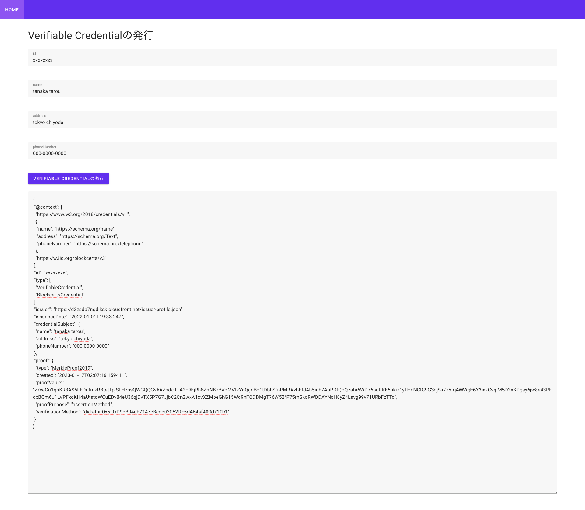

Issuer用のWebAppをデプロイ/Deploy WebApp for Issuer
===

## CDKを使ったデプロイ/Deploy with CDK

- issuerwebappをビルドする  
Build to issuer webapp

```
$ pwd
decentralized-identity-sample

$ cd issuerwebapp/
$ npm install
$ npm run build
```
- ビルド済み資材が`issuerwebapp/dist/`に保存されたことを確認する  
builded package are stored in `issuerwebapp/dist/`

```
$ pwd
decentralized-identity-sample/issuerwebapp

$ ls dist/
css  favicon.ico  fonts  index.html  js
```

- アクセス可能なIPアドレスを制限するために、環境変数を設定する.  
Assuming it's a demo environment, set environment variables to limit the IP addresses that can be accessed.
```
$ export SOURCE_IP_ADDRESS=xxx.xxx.xxx.xxx/32
```

- Ethereum Nodeのエンドポイント  
Endpoint of Ethereum Node  
```
$ export ETHEREUM_ENDPOINT=https://ETHEREUM_ENDPOINT
```

- アクセス可能な国を制限するために、環境変数を設定する.  
コンテンツの地理的ディストリビューションの制限についてはこちらを参照してください  
Assume that it is a verification environment and set environment variables to limit the countries that can be accessed.  
Please check here for restricting the geographic distribution of content  
https://docs.aws.amazon.com/AmazonCloudFront/latest/DeveloperGuide/georestrictions.html  
リージョン名はISO3166-1で定義されているフォーマットです.  
Region name are in the format defined by ISO3166-1
https://ja.wikipedia.org/wiki/ISO_3166-1

```
$ export ACCESS_FROM_REGION=JP
```

- issuerの秘密鍵とprofileのurlを環境変数に設定する  
set the issuer's private key and issuer profile url in environment variables.
```
$ export ISSUER_PRIVATEKEY=0x.....
$ export ISSUER_PROFILE_URL=<cloudfront endpoint>/issuer-profile.json
```

- issuerの設定ファイルを編集する. 設定内容は[証明書の発行](../HowToUse/IssuingVCWithCLI.md)を参照  
Modify issuer's config file. Please check at [Issuance of certificates](../HowToUse/IssuingVCWithCLI.md)

```
$ cd ../cdk
$ pwd
decentralized-identity-sample/cdk

$ cp lambda/python/Issue_vc/conf-template.ini lambda/python/issue_vc/conf.ini 
$ vi lambda/python/issue_vc/conf.ini 
```

- CDKを使用してデプロイする。出力結果はメモしておくこと  
Deploy with CDK. Please note of results.

```
$ pwd
decentralized-identity-sample/cdk

$ cdk deploy IssuerWebapp
```
```
IssuerWebapp.ApiEndpointForIssuerWebApp = https://aaaaaaaaa.execute-api.ap-northeast-1.amazonaws.com/prod/
IssuerWebapp.DIDApiEndpointE505696C = https://aaaaaaaaa.execute-api.ap-northeast-1.amazonaws.com/prod/
IssuerWebapp.DIDViewerEndpointForIssuer = https://bbbbbbbbbbb.cloudfront.net
IssuerWebapp.SecretIssuerPrivateKeyArn = arn:aws:secretsmanager:ap-northeast-1:00000000000:secret:SecretIssuerPrivateKey...
IssuerWebapp.UserPoolId = ap-northeast-cccccccccccc
IssuerWebapp.UserPoolWEBClientIdForIssuerWebApp = ddddddddddddd
```


- CDKの出力結果を使用してvuejs用の設定ファイルを作成する  
Modify vue.js config with CDK results.
```
$ cd ../issuerwebapp/
$ pwd
decentralized-identity-sample/issuerwebapp

$ vi .env.local
```
```
VUE_APP_AWS_REGION=ap-northeast-1
VUE_APP_API_ENDPOINT=https://aaaaaaaaa.execute-api.ap-northeast-1.amazonaws.com/prod/
VUE_APP_USER_POOL_ID=ap-northeast-cccccccccccc
VUE_APP_USER_POOL_WEB_CLIENT_ID=ddddddddddddd
```

- 設定ファイルを反映するために再度webappをビルドする.  
Build the webapp again to reflect the configuration files.  
```
$ pwd
decentralized-identity-sample/issuerwebapp

$ npm run build
```

- 再度CDKでデプロイすることで変更した設定ファイルの内容が反映される。  
The contents of the changed configuration file are reflected by deploying again with CDK.
```
$ cd ../cdk/
$ pwd
decentralized-identity-sample/cdk

$ cdk deploy IssuerWebapp
```

- ブラウザを使用して`DIDViewerEndpointForIssuer`にアクセスする.  
Access to `DIDViewerEndpointForIssuer` via your browser



