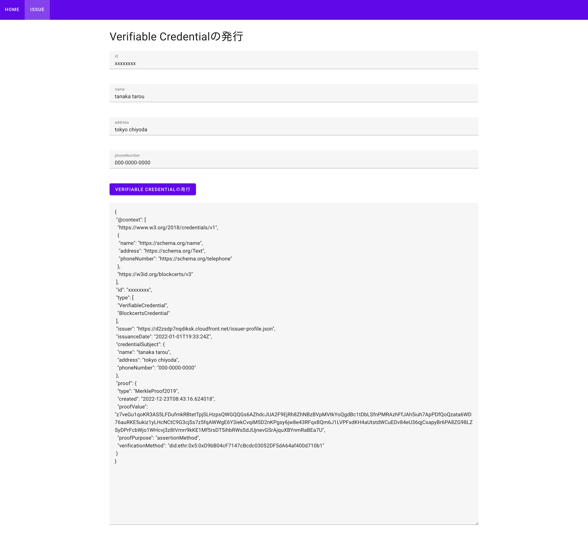

証明書の発行/Issuance of certificates
===

- ブラウザで`DIDViewerEndpointForIssuer`にアクセスする。  
Access to `DIDViewerEndpointForIssuer` via your browser

- ログイン画面が表示されたら、`Create Account`からアカウントを作成する.
When login screen is displayed, push `Create Account` button to create an account

- アカウント作成後にログインをする  
After create account, you can login.

- 画面上部より`HOME`をクリックする。証明書発行画面に遷移する  
Move to `Home` tab 

- 必要事項を入力し、`VERIFIABLE CREDENTIALの発行`ボタンを押下する  
Enter the required information and press the `VERIFIABLE CREDENTIALの発行` button.

- 出力された証明書をファイルに保存し、`https://www.blockcerts.org/`で検証する。  
Save the result of Verifiable Credential. You can verify at `https://www.blockcerts.org/`
