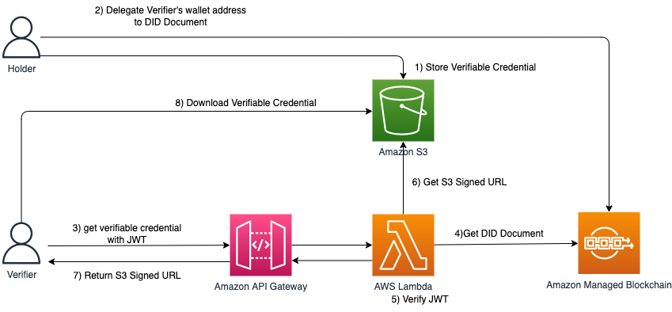

Verifiable Credentialの取得方式/How does Verifier obtain Verifiable Credential from Holder
===

VerifiableCredentialはその所有者のS3 Bucketに保存されている。  
Verifiable Credential are stored at S3 Bucket owned by the Holder.

S3 BucketはPrivateに設定されておりインターネットに公開はしていない。  
S3 buckets are not exposed to the internet. It's a private bucket.

所有者以外がVerifiable Credentialにアクセスをするには、S3に保存されているオブジェクトに対して参照が可能となる署名付きURLをVerifiable Credentialの所有者に発行してもらう必要がある。  
In order for anyone other than the Holder to access the Verifeable Credential, it is necessary to have the Holder of the Verifiably Credentials issue a signed URL that can be referenced to the object stored in S3.

DID Document、Delegate、JWTの要素を組み合わせることで、DID Documentに対して権限を持つユーザーであれば、JWTの認証によって署名付きURLの発行を許可する仕組みを作ることができる。

By combining the elements of a DID Document, Delegate, and JWT, it is possible to create a mechanism that permits the issuance of a signed URL by JWT authentication if the Verifier has authority over the DID Document.

